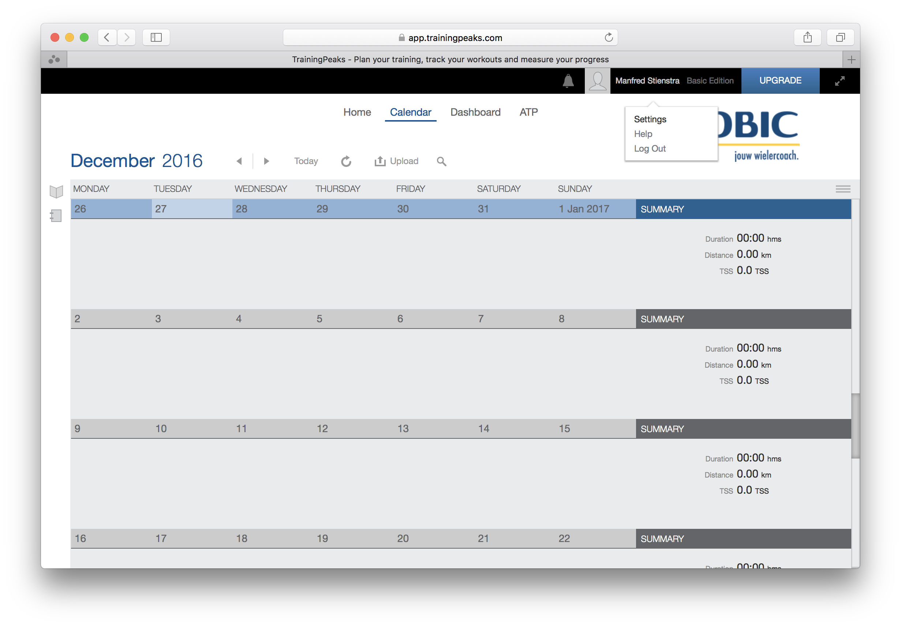
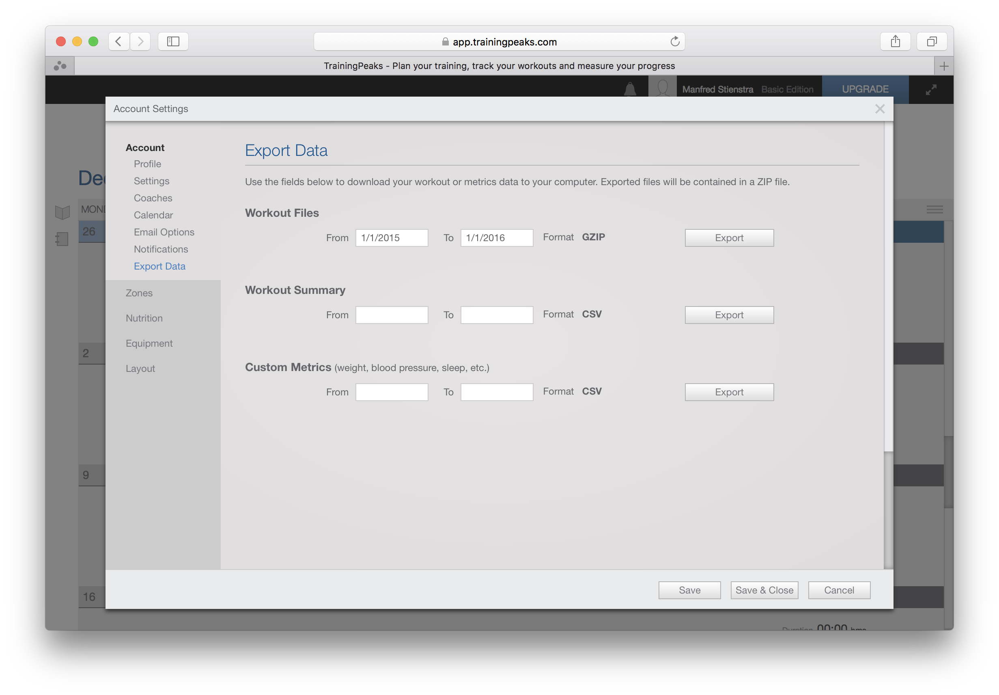
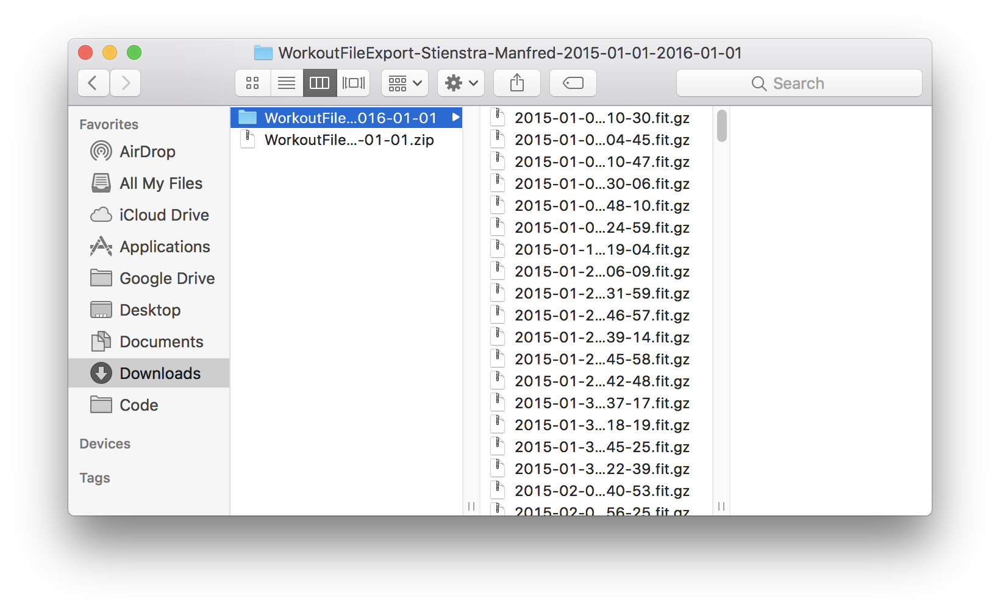
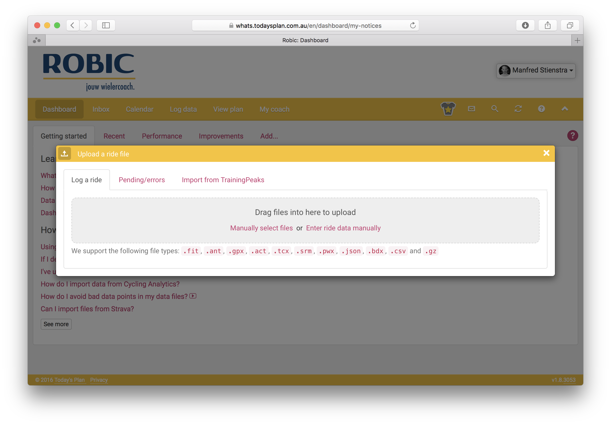
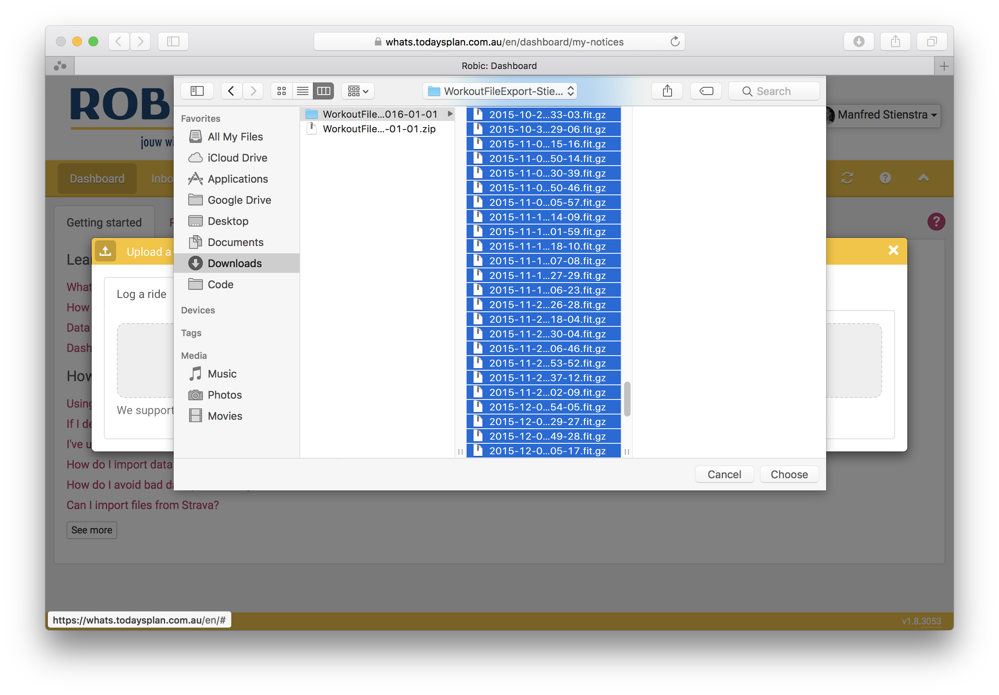

# Data meenemen van TraningPeaks naar Today's Plan

Om je historische data in Today's Plan te krijgen moet je deze eerst exporteren vanuit TrainingPeaks. Dit kan helaas maar voor maximaal één jaar per export, dus zal in een paar stappen moeten.

Eerst ga je naar de instellingen van je TrainingPeaks account en daar klik je op ‘Export Data’.

Om snel het afgelopen jaar te exporteren kan je het beste de datums intiepen, van: 1/1/2016 tot 1/1/2017. Vervolgens klik je op ‘Export’ na even wachten verschijnt er een link om een bestand te downloaden. Dit herhaal je een aantal keer afhankelijk van hoeveel historische data je mee wil nemen.

TrainingPeaks exporteert een ZIP bestanden met daarin de originele bestanden uit je fietscomputer. Om deze in Today's Plan te kunnen importeren moet je eerst het ZIP bestand uitpakken. De ZIP bestanden heb je daarna niet meer nodig en kan je verwijderen.

> Op de meeste computers kan je ZIP bestanden zonder extra software uitpakken. Als je een wat oudere versie van Windows gebruikt dan kan je bijvoorbeeld [7-Zip](images/http://www.7-zip.org) installeren.

Log nu in op Today's Plan en klik op het tabje ‘Log data’.

> Kies niet ‘Import from TrainingPeaks’, dit is voornamelijk bedoeld voor import van metrics (gewicht, voeding, etc) en workouts (het plan dat door je trainer is ingevuld). Als je wel workouts importeert dan zal **alle data dubbel in Today's Plan verschijnen**. Het is vrij veel werk om dat weer netjes te verwijderen.

Op het tabje ‘Log a ride’ kan je kiezen voor ‘Manually select files’ en de uitgepakte bestanden uploaden. Het is ook mogelijk om deze bestanden direct de browser in te slepen.

Het is mogelijk dat een import op deze manier heel veel berichten en waarschuwingen in je Inbox produceert. Dit is helaas een functie van Today's Plan die op dit moment tegen je werkt, later is dit een handige manier om bijvoorbeeld achter een verkeerd ingestelde fietscomputer te komen.

Zorg na de export dat de FTP in Today's Plan overeenkomt met de FTP waarde en dan ben je klaar voor 2017!